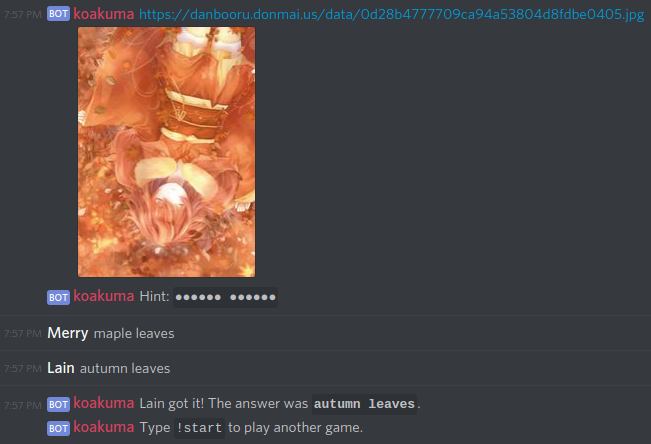

# Koakuma!
Discord bot for a Danbooru tag-guessing game.

## Usage
Store a bot client token in the environment variable `KOAKUMA_TOKEN`, then `python3 koakuma.py` to run the bot.

## Gameplay
Type `!start` to begin the game.

First, Koakuma links a number of Danbooru images that share a common, randomly-selected tag.

Then, she starts revealing the tag name letter-by-letter.

Type tags in the channel to guess the answer!
